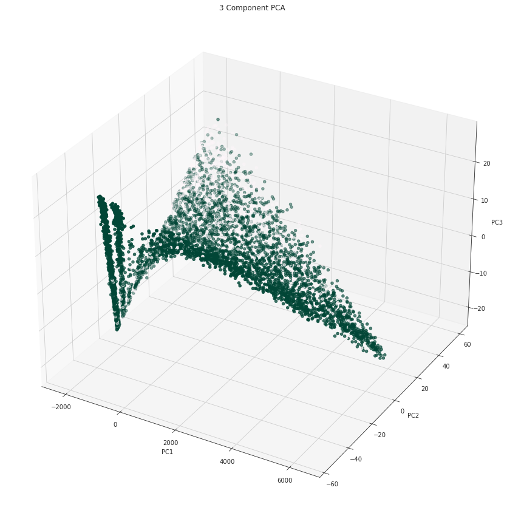

# Customer Churn analysis for service-based business models

### Michael Ransby, Brandon Beck

## Problem Definition
Business analysts often find themselves trying to optimize for the customer experience, with a "red flag" being the churn rate of customers - they've been sucked in but aren't convinced the value provided exceeds the value attained through continued payments for a given service. 
This project aims to serve as a proof of concept for a given business to analyze various customer metrics - and ensure they are informed by those that correlate with the real world. 

### Citations
The first citation would be a conversation between Michael and a colleague/mentor. 

The conversation piqued an interest in machine learning and data analysis for business analytic pipelines. This project serves as a proof of concept to build a pipeline around, such that Michael can continue to provide data-driven business analytics.

https://medium.com/@paldesk/what-is-customer-churn-how-to-reduce-it-402460e5b569

https://www.profitwell.com/recur/all/involuntary-delinquent-churn-failed-payments-recovery

## Data Collection
Looking through the various datasets available, we found many datasets on Kaggle. Many of these have a high number of observations, and features - allowing for demonstration of an explained variance process. 

The high dimensionality of the dataset will allow us to identify key attributes of customers that have an influence or indication about their likelihood to churn. 

Kaggle had the entire dataset available for download as a CSV, which is a straightforward filetype to handle.

## Data Preprocessing
The dataset can be handled easily using pandas. The dataset contains a few datatypes so something like NumPy cannot be used. Pandas is easily able to clean the data of points that contain empty or invalid cells. When something empty or invalid is found that entire data point is removed as opposed to interpolating the data by for example taking the mean of that feature (for numerical features). Something like taking the mean would only serve to bias the incomplete user data towards the others, so we avoid this.

## Methods
### Encoding
Using the `pandas` library, we are simply able to assign a datatype (category, float, etc) to import our data from the CSV format given. We now have a data frame, which is easily usable for our purposes.

Nominal variables have been "dummied", such that each unique value in each category becomes a boolean.

Ordinal variables (an example would be credit score) are to be encoded as integers, remaining in place in a single column.

### Preliminary Data Check
Checking the balance of the classes (Churned/Not Churned), we see a distribution of 26.5% Not and 73.5% churned. To overcome this we used the SMOTE method from the library `imblearn` to balance the classes for training and testing. It is not mentioned in the notebook, however, this boosted accuracy across all models tested by roughly 5%.

### Feature Importance
We used an implementation of the random forest classifier from the previous homework to find the importance of each feature in the dataset. By fitting the data we can make a plot of the feature importance attribute to identify the relevant features in the dataset. 

Interestingly, the feature making a customer least likely to churn is their tenure (the number of months they have been retained as a customer). This is consistent with a customer being on a "month to month" contract, which most positively indicates the churn of a given customer.

### SVD 2D

### SVD 3D

### Model Selection 
In the [Jupyter Notebook](churn-notebook.html), we perform a search across many parameters across DecisionTree, AdaBoost, RandomForest, Logistic Regression, and a Tensorflow Sequential Neural Network through the use of the GridSearchCV tool built into scikit-learn. See the notebook for accuracy per model and their corresponding confusion matrices 

## Results

The Random Forest Classifier was shown to have the highest accuracy (83%) across our testing, with the following confusion matrix.

The feature importance plot outlined in our methods showed that a customer’s loyalty to the provider is the highest correlating feature in the set. After loyalty, the existence of a month-to-month contract weighs heavily in a customer’s likelihood to churn. This is followed closely by both numerical values surrounding the cost, with total cost weighing a lot more. After these, the top features generally surround the quality of the product and ease of service provided by the company. Features such as gender, age, marriage status, and having dependents weighed very low in the indication of churn.

## Discussion

A few interesting points came up through data exploration

### Number of customers by Contract type

Although "month-to-month" was identified as having a positive correlation with churn, this group makes up the largest proportion of overall customers. More exploration is required to ascertain the reason for this, be it economic or business model related.

### Distribution of customers by tenure

This chart displays a textbook example of a "bathtub" curve. Customers at 70 months are explained by the inception of our services. Of concern is the distribution of customers below 10 months. The onboarding process must be analyzed for abrasion to the customer. 

### Churn by Monthly Charge

Unsurprisingly, it appears customers with a lower monthly charge are less likely to churn

## Conclusion
As a result of this study, we can affirm that certain attributes such as the use of a one or two-year contract, along with reducing the number of superfluous features (StreamingTV/Movies, Tech support, and device protection) can be used with high accuracy to determine which customers are likely to discontinue your service or switch to another provider. 

Moving forward, this model could be expanded as a recommender of features/offers to customers to reduce overall churn.

This information is critical for companies that struggle with retention or want to target certain groups to gain traction with their demographic. Using targeted deals and pricing, this model can show a company that users need a nudge to remain loyal to their brand. In this instance, phone companies can analyze the prices to set and deals to offer when comparing to their rival providers.
